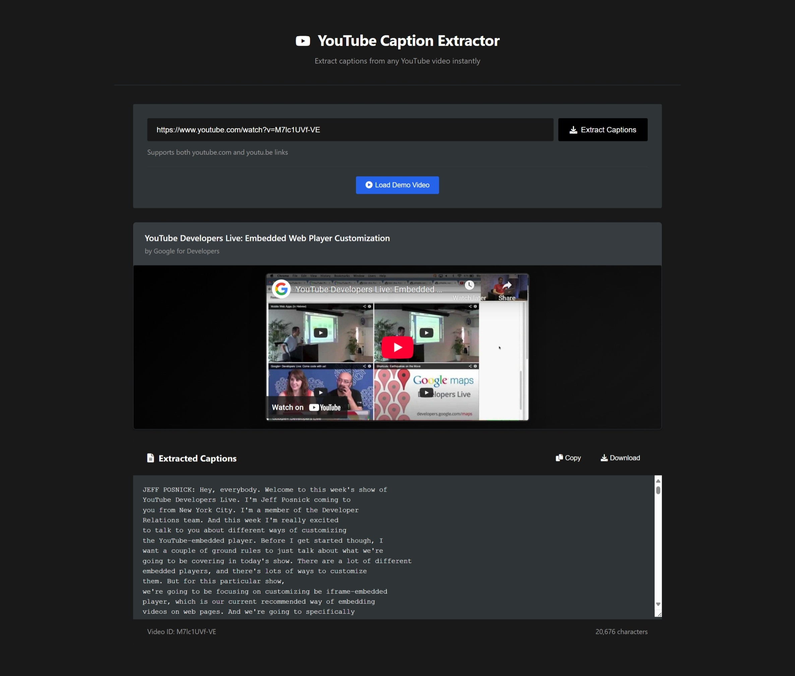

# 📺 YouTube Caption Extractor

A simple web application that extracts captions from YouTube videos instantly. Built with FastAPI backend and a clean static frontend.



## ✨ Features

- Extract captions from any YouTube video
- Works with both youtube.com and youtu.be links
- Copy or download extracted captions

## 🚀 Quick Start

1. **Install dependencies:**

   ```bash
   pip install -r requirements.txt
   ```

2. **Start the backend:**

   ```bash
   python -m uvicorn app.main:app --reload --port 8000
   ```

3. **Start the frontend:**

   ```bash
   python -m http.server 3000 --directory docs
   ```

4. **Open your browser:**
   Navigate to `http://localhost:3000`

## 📁 Project Structure

```

├── app/                 # FastAPI backend
│   ├── main.py         # Application entry point
│   ├── api/routes/     # API endpoints
│   ├── services/       # Caption extraction logic
│   └── schemas/        # Request/response models
├── docs/               # Static frontend
│   ├── index.html      # Main page
│   ├── style.css       # Styling
│   └── script.js       # Frontend logic
└── requirements.txt    # Dependencies

```

## 🔧 How It Works

1. Paste a YouTube URL into the input field
2. Click "Extract Captions" to fetch video captions
3. View the video with extracted captions below
4. Copy or download the captions as needed

## �️ Built With

- **Backend:** FastAPI, youtube-transcript-api
- **Frontend:** Vanilla HTML/CSS/JavaScript
- **Styling:** Notion-inspired design system

## 📝 License

Built for Day 6 Technical Assignment of AI Education Innovation Hackathon by Chunjae Education.
